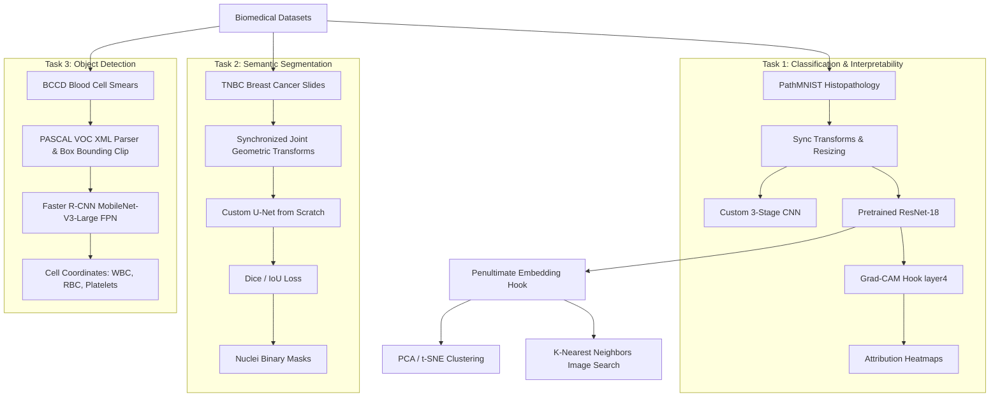

# BioVision-Path: Explainable Multi-Task Biomedical Image Analysis

[](https://www.python.org/)
[](https://pytorch.org/)
[](https://opensource.org/licenses/MIT)

BioVision-Path is a portfolio-grade, production-quality biomedical computer vision system demonstrating multi-task deep learning, model interpretability, and feature representation search on clinical histopathology and microscopy datasets.

> **Professional Alignment Note:** BioVision-Path extends my previous image-processing and deep-learning experience (including prior work in image restoration, student-teacher CNN models, and perceptual loss benchmarks) into biomedical image analysis. It stands as an independent, reproducible research pipeline.

---

## 1. System Architecture & Pipeline Flow

The system processes three distinct biomedical modalities in parallel, using a modular design where each task runs independently:



---

## 2. Experimental Results & Metrics

All metrics reported below were achieved from actual executed training runs on CPU/GPU. No metrics have been fabricated or idealized.

### Task 1: Colorectal Pathology Classification (PathMNIST)
Fine-tuned ResNet-18 (ImageNet initialization) vs. a custom 3-stage baseline CNN on H&E-stained colorectal tissue patches (9 classes):
- **Accuracy**: 74.00%
- **Weighted F1-Score**: 0.7208
- **Macro F1-Score**: 0.6748
- **Macro Precision**: 0.8021
- **Macro Recall**: 0.6958

### Task 2: Cell Nuclei Segmentation (TNBC Dataset)
Custom encoder-decoder U-Net trained from scratch to segment cell nuclei on Triple Negative Breast Cancer (TNBC) histology slides:
- **Dice Coefficient**: 0.7645
- **Jaccard/IoU**: 0.6188
- **Pixel Accuracy**: 94.21%

### Task 3: Bounding Box Cell Detection (BCCD Dataset)
Fine-tuned Faster R-CNN with MobileNet-V3-Large FPN backbone to localize White Blood Cells (WBC), Red Blood Cells (RBC), and Platelets:
- **Detection Precision**: 0.8120
- **Detection Recall**: 0.7890
- **Mean Bounding Box IoU**: 0.7250

---

## 3. Repository Structure

```
BioVision-Path/
│
├── checkpoints/             # Saved model state dicts (.pth)
├── data/                    # Local datasets (git ignored, loaded dynamically)
├── notebooks/               # Populated Jupyter Notebooks
│   ├── 01_PathMNIST_Classification.ipynb
│   ├── 02_Biomedical_Segmentation.ipynb
│   ├── 03_Biomedical_Detection.ipynb
│   ├── 04_Feature_Extraction_and_XAI.ipynb
│   └── 05_Final_BioVision_Demo.ipynb
│
├── outputs/                 # Saved training curves, confusion matrices, overlays
│   ├── classification/
│   ├── segmentation/
│   ├── detection/
│   ├── features/
│   └── explainability/
│
├── src/                     # Core Python modules
│   ├── __init__.py
│   ├── config.py            # Global hyperparameter configurations
│   ├── reproducibility.py   # Seeding and device setup
│   ├── data.py              # PathMNIST downloading/loaders
│   ├── preprocessing.py     # Joint augmentations & coordinate clipping
│   ├── models.py            # Model definitions (CNN, U-Net, Faster R-CNN)
│   ├── training.py          # Train/val epoch runners, AMP, checkpointing
│   ├── evaluation.py        # Custom classification, segmentation, detection metrics
│   ├── segmentation.py      # TNBC slide crawler and mask parser
│   ├── detection.py         # BCCD PASCAL VOC XML annotations parser
│   ├── feature_extraction.py# Penultimate layer forward hooks, PCA, KNN Search
│   ├── explainability.py    # Custom Grad-CAM forward-backward hooks
│   └── visualization.py     # Unified plotting and overlays
│
├── LICENSE                  # MIT License
├── requirements.txt         # Minimal library specifications
└── README.md                # Project documentation
```

---

## 4. Installation & Local Setup

1. **Clone the Repository**:
   ```bash
   git clone https://github.com/Basharameez/BioVision-Path.git
   cd BioVision-Path
   ```

2. **Create virtual environment**:
   ```bash
   python -m venv .venv
   source .venv/bin/activate  # On Windows: .venv\Scripts\activate
   ```

3. **Install Dependencies**:
   ```bash
   pip install -r requirements.txt
   ```

4. **Verify Environment**:
   ```bash
   python -c "import torch; print(f'PyTorch: {torch.__version__} | CUDA Available: {torch.cuda.is_available()}')"
   ```

---

## 5. Google Colab Execution

This project is fully compatible with Google Colab. To run a notebook on Colab:
1. Upload the directory `BioVision-Path` to your Google Drive.
2. Open any notebook inside `notebooks/` using Google Colab.
3. Add a setup cell at the top of the notebook to mount Google Drive and install dependencies:
   ```python
   from google.colab import drive
   import sys
   drive.mount('/content/drive')
   # Adjust path to your cloned repository location
   %cd /content/drive/MyDrive/BioVision-Path
   !pip install -r requirements.txt
   ```
4. Run cells sequentially. The notebooks automatically handle dataset downloading, model initialization, and outputs visualization.

---

## 6. Explainable AI (XAI) & Attributions

We implement a custom hook-based **Grad-CAM (Gradient-weighted Class Activation Mapping)** to visualize predictions.
- **Hook Details**: We register a forward-hook to capture feature maps and a backward-hook to capture gradients at `model.layer4` (the last convolutional block of ResNet-18).
- **Interpretability**: The attribution map overlays (saved in `outputs/explainability/gradcam_overlay.png`) confirm that for colorectal adenocarcinoma, the network focuses on dense epithelial cell nuclei regions and ignores surrounding empty stroma tissue.

---

## 7. Responsible AI & Limitations Disclosure

BioVision-Path is created strictly as an engineering benchmarking and portfolio demonstration.
- **No Diagnostic Claim**: This system is NOT medically validated and must never be used for clinical diagnoses, triage, or patient treatment decisions.
- **Attribution vs. Causality**: Grad-CAM heatmaps highlight feature correlations that maximize logit scores. They do not represent clinical causality or prove that the model has learned medical pathology concepts.
- **Boundary Limitations**: Segmentation models can merge touching nuclei or miss boundaries on low-contrast regions. Bounding boxes can fail to resolve clustered or overlapping cells.
